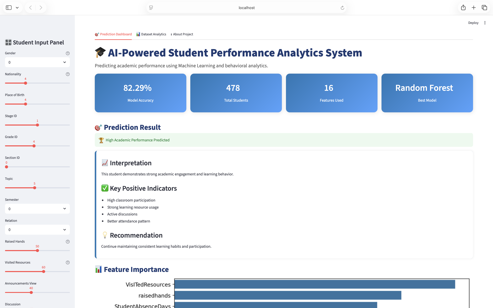
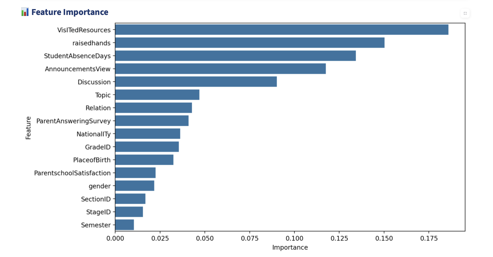
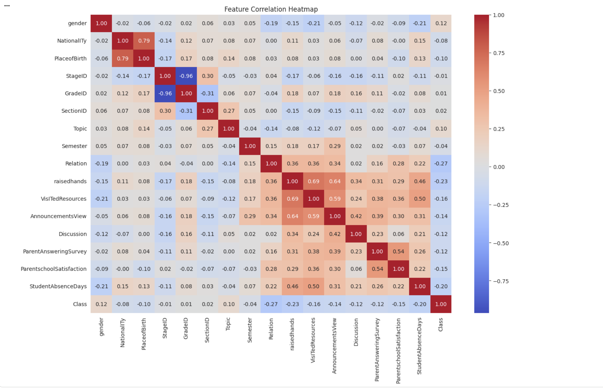
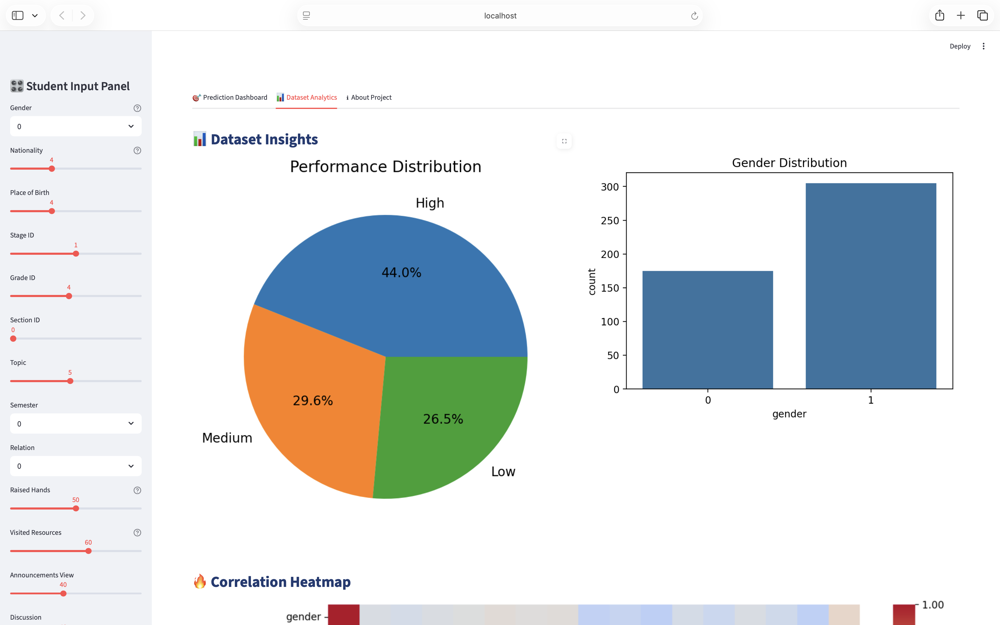

# 🎓 AI-Powered Student Performance Analytics System

An advanced Machine Learning-based web application built using Streamlit that predicts student academic performance using behavioral and educational analytics.


🌐 **Live Demo:** [student-performace-prediction.streamlit.app](https://student-performance-system-7mrj25jkkpztwmnzm84jcu.streamlit.app) 


# 🚀 Project Overview

This project analyzes student behavior, engagement, attendance, and learning activities to predict academic performance categories:

- High Performance
- Medium Performance
- Low Performance

The system uses Machine Learning algorithms and interactive data visualizations to help educators identify student performance patterns.

---

# 📸 Project Screenshots

## 🎯 Main Dashboard



---

## 🔥 Feature Importance



---

## 🌡 Correlation Heatmap



---

## 📈 Dataset Analytics



--- 

# 🧠 Features

✅ Student Performance Prediction  
✅ Interactive Dashboard  
✅ Behavioral Analytics  
✅ Feature Importance Visualization  
✅ Prediction Confidence Graph  
✅ Correlation Heatmap  
✅ Student Engagement Radar Chart  
✅ Dataset Insights & Analytics  
✅ Real-Time User Inputs  
✅ AI-Based Recommendations

---

# 🛠 Technologies Used

- Python
- Streamlit
- Pandas
- NumPy
- Scikit-Learn
- Matplotlib
- Seaborn
- Plotly

---

# 📊 Machine Learning Models Used

| Model | Accuracy |
|---|---|
| Logistic Regression | 82.29% |
| Decision Tree | 64.58% |
| Random Forest | 85.42% |

🏆 Best Performing Model: Random Forest Classifier

---

# 📂 Dataset

Dataset Used : xAPI-Edu-Data.csv 

Link : https://www.kaggle.com/datasets/aljarah/xAPI-Edu-Data 

The dataset contains:
- Student demographic information
- Academic engagement
- Attendance behavior
- Learning interaction metrics

---

# 🔥 Important Features Identified

Top features influencing student performance:

- VisITedResources
- raisedhands
- StudentAbsenceDays
- AnnouncementsView
- Discussion

---

# 🖥 Dashboard Modules

## 📌 Prediction Dashboard
Predicts academic performance based on student inputs.

## 📌 Dataset Analytics
Provides visual insights using:
- Pie Charts
- Heatmaps
- Distribution Charts
- Correlation Analysis

## 📌 About Project
Contains:
- Project Objective
- Technologies Used
- Real World Applications
- Future Scope

---

# 📈 Real World Applications

- Early identification of struggling students
- Educational analytics
- Academic intervention planning
- Smart learning systems
- Student engagement monitoring

---

# ⚡ Installation & Setup

## Step 1: Clone Repository

```bash
git clone https://github.com/your-username/student-performance-analytics.git
```

## Step 2: Open Project Folder

```bash
cd student-performance-analytics
```

## Step 3: Install Dependencies

```bash
pip install -r requirements.txt
```

## Step 4: Run Streamlit App

```bash
streamlit run app.py
```

---

# 🌐 Deployment

The project can be deployed using:

- Streamlit Cloud
- Render
- HuggingFace Spaces

---

# 💡 Future Improvements

- Deep Learning Integration
- Student Report PDF Generation
- Multi-user Authentication
- Database Integration
- Live School Dashboard
- AI Chat Assistant for Recommendations

---

## 👤 Author

**Name**: ALVIRA PARVEEN  
🔗 [LinkedIn](https://www.linkedin.com/in/alvira-parveen-78022536b)  
🌐 [GitHub](https://github.com/Alvira-Parveen)

---

## 📄 License

This project is licensed under the MIT License — see the [LICENSE](LICENSE) file for details.

---
# 🎯 Conclusion

This project demonstrates how Machine Learning and educational analytics can help improve academic monitoring and student success prediction through interactive AI-powered dashboards.
